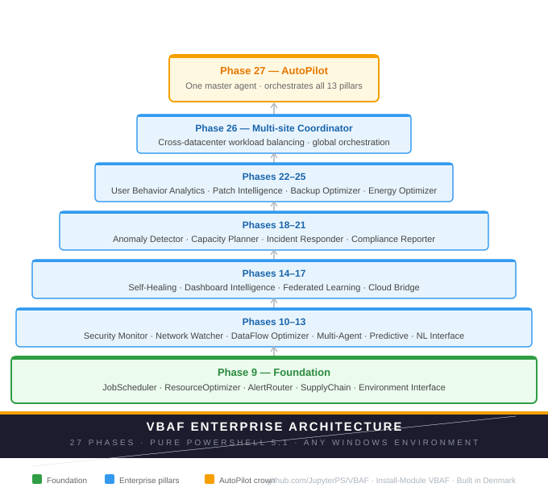

# VBAF — Visual AI & Reinforcement Learning Framework

> **v5.0.0** · PowerShell 5.1 · Educational AI Framework · Learn by doing

[](LICENSE)
[](https://github.com/PowerShell/PowerShell)
[](https://www.powershellgallery.com/packages/VBAF)
[](https://www.powershellgallery.com/packages/VBAF)
[](https://github.com/JupyterPS/VBAF/stargazers)

## Architecture

[](https://github.com/JupyterPS/VBAF)

## What is VBAF?

VBAF is a **hands-on educational framework** for learning artificial intelligence and reinforcement learning concepts — written entirely in PowerShell 5.1 that ships with every Windows PC.

No Python. No Jupyter. No cloud dependencies. Just open PowerShell and start learning.

**What you can learn with VBAF:**

- How neural networks learn through backpropagation
- How Q-learning agents discover optimal strategies without being told the rules
- How Deep Q-Networks (DQN) scale reinforcement learning to complex problems
- How multiple agents compete and cooperate in shared environments
- How to normalise, scale and clean data before feeding it to an AI model

**Why PowerShell?**

Because the code is readable. Every function in VBAF is written to be understood — not just executed. You can open any `.ps1` file and see exactly what the algorithm is doing, line by line. That is the point.

---

## Quick Start

```powershell
# Install
Install-Module VBAF -Scope CurrentUser

# Navigate to your working folder
cd "C:\Users\\OneDrive\WindowsPowerShell"

# Load everything
. .\VBAF.LoadAll.ps1

# Run the XOR example -- the classic neural network benchmark
cd examples\01-XOR-Network
. .\Run-Example-01.ps1

# Watch a Q-learning agent learn castle sequences
cd ..\02-Castle-Learning
. .\Run-Example-02.ps1

# See competing market agents emerge pricing strategies
cd ..\03-Market-Simulation
. .\Run-Example-03.ps1
```

---

## Learning Path

Start here and work through in order:

| Step | Example | What you learn |
|------|---------|----------------|
| 1 | [XOR Network](examples/01-XOR-Network/) | Neural networks, backpropagation, convergence |
| 2 | [Castle Learning](examples/02-Castle-Learning/) | Q-learning, rewards, emergent strategy |
| 3 | [Market Simulation](examples/03-Market-Simulation/) | Multi-agent competition, Nash equilibrium |
| 4 | [Learning Dashboard](examples/04-Learning-Dashboard/) | Visualising training progress |
| 5 | [Validation Dashboard](examples/05-Validation-Dashboard/) | Evaluating model quality |
| 6 | [Custom Agent](examples/06-Custom-Agent/) | Build your own RL environment |

Each example folder contains a `Run-Example-XX.ps1` launcher -- just run that.

---

## Educational Tools

Three interactive tools for guided learning:

```powershell
# Console teacher -- 6 topics, press Enter to advance
Start-VBAFTeach

# Jump to one topic directly
Start-VBAFTeach -Topic "DQN"
Start-VBAFTeach -Topic "QLearning"
Start-VBAFTeach -Topic "Enterprise"

# Interactive experiment station -- pick algorithm, configure, watch it train
Start-VBAFPlayground

# Jump to one playground directly
Start-VBAFPlayground -Algorithm "DQN"
Start-VBAFPlayground -Algorithm "Enterprise"
Start-VBAFPlayground -Algorithm "Supervised"
```

---

## Documentation

| Document | Description |
|----------|-------------|
| [Getting Started](docs/GettingStarted.md) | Install, load, run your first example |
| [Theory](docs/Theory.md) | The AI/RL concepts behind VBAF explained simply |
| [API Reference](docs/API-Reference.md) | All functions, parameters and return values |
| [Architecture](docs/Architecture.md) | How the framework is structured |
| [FAQ](docs/FAQ.md) | Common questions and answers |
| [Tutorials](docs/tutorials/) | Step-by-step walkthroughs |
| [Teaching Materials](docs/teaching/) | Course outlines, exam questions, semester plans |
| [Case Studies](docs/case-studies/) | Real learning experiments and results |

---

## What is in the box?

### Core AI modules

| Module | What it teaches |
|--------|----------------|
| `VBAF.Core.AllClasses.ps1` | Neural network architecture -- layers, weights, activations |
| `VBAF.RL.QLearningAgent.ps1` | Q-learning -- the foundation of modern RL |
| `VBAF.RL.DQN.ps1` | Deep Q-Networks -- combining neural nets with RL |
| `VBAF.RL.PPO.ps1` | Proximal Policy Optimisation -- stable policy gradients |
| `VBAF.RL.A3C.ps1` | Async Advantage Actor-Critic -- parallel RL workers |
| `VBAF.RL.Environment.ps1` | Environments -- CartPole, GridWorld, RandomWalk |
| `VBAF.Business.MarketEnvironment.ps1` | Multi-agent market simulation |

### Supervised learning modules

| Module | What it teaches |
|--------|----------------|
| `VBAF.ML.Regression.ps1` | Linear, Ridge, Lasso, Logistic regression |
| `VBAF.ML.Trees.ps1` | Decision trees and Random forests |
| `VBAF.ML.Clustering.ps1` | KMeans, DBSCAN, Hierarchical clustering |
| `VBAF.ML.NaiveBayes.ps1` | Gaussian, Multinomial, Bernoulli Naive Bayes |
| `VBAF.ML.DataPipeline.ps1` | Imputation, scaling, encoding |
| `VBAF.ML.AutoML.ps1` | Grid, random and Bayesian hyperparameter search |
| `VBAF.ML.Explainability.ps1` | SHAP, LIME, permutation importance |

### Educational tools

| Tool | What it does |
|------|-------------|
| `VBAF.Teach.ps1` | Console teacher -- 6 topics, step by step |
| `VBAF.Playground.ps1` | Interactive experiment station -- no coding needed |

### Visualisation

| Module | What it teaches |
|--------|----------------|
| `VBAF.Visualization.LearningDashboard.ps1` | Live training curves |
| `VBAF.Visualization.MarketDashboard.ps1` | Live market competition |
| `VBAF.Art.CastleCompetition.ps1` | Visualising multi-agent competition |

---

## The XOR benchmark

XOR is the classic test of whether a neural network can learn non-linear patterns.
A linear model cannot solve it -- you need at least one hidden layer.

```powershell
. .\VBAF.LoadAll.ps1
cd examples\01-XOR-Network
. .\Run-Example-01.ps1

# Expected output:
# XOR Truth Table:
#   0 XOR 0 = 0  (predicted: 0.02)
#   0 XOR 1 = 1  (predicted: 0.97)
#   1 XOR 0 = 1  (predicted: 0.96)
#   1 XOR 1 = 0  (predicted: 0.03)
# Epochs: 847  Loss: 0.008
```

If you see predictions close to 0 and 1 -- the network learned. That is backpropagation working.

---

## The Castle Learning experiment

A Q-learning agent generates castle sequences and discovers that variety is rewarded.
No strategy is programmed. The agent finds it through trial, error and reward signals.

```powershell
cd examples\02-Castle-Learning
. .\Run-Example-02.ps1

# Watch the Q-table grow:
# Episode   1 | Q-Table:  10 entries | Exploit:  0.0%
# Episode  50 | Q-Table: 286 entries | Exploit: 11.6%
# Episode 100 | Q-Table: 383 entries | Exploit: 22.2%
```

This is reinforcement learning in its purest form -- learning from reward signals, not from labelled examples.

---

## Beyond the basics -- Enterprise Automation

Once you understand the foundation phases (1-9), VBAF includes 14 enterprise pillars built on the same core -- each one a working DQN agent solving a real IT automation problem.

| Phase | Pillar | What it automates | Improvement |
|-------|--------|------------------|-------------|
| 14 | Self-Healing | Detects and fixes system problems automatically | +63.0% |
| 15 | Dashboard | Intelligent cache and refresh management | +59.1% |
| 16 | Federated Learning | Distributed model training across nodes | +62.1% |
| 17 | Cloud Bridge | Local vs cloud workload balancing | +24.5% |
| 18 | Anomaly Detector | Spots unusual patterns before they become incidents | +30.6% |
| 19 | Capacity Planner | Predicts resource needs before you run out | +32.6% |
| 20 | Incident Responder | Automated incident triage and containment | +26.9% |
| 21 | Compliance Reporter | GDPR/ISO27001 compliance monitoring | +107.2% |
| 22 | User Behavior Analytics | Detects insider threats and anomalous access | +103.4% |
| 23 | Patch Intelligence | Risk-aware patch scheduling and rollback | +65.5% |
| 24 | Backup Optimizer | Adaptive backup strategy optimisation | +116.3% |
| 25 | Energy Optimizer | Reduces power consumption intelligently | +117.5% |
| 26 | Multi-Site Coordinator | Cross-datacenter workload balancing | +47.4% |
| 27 | AutoPilot | Orchestrates all 13 pillars simultaneously | +63.3% |

**The learning ladder:**
Phase 1-9   -- Foundation: understand HOW agents learn

Phase 10-27 -- Enterprise: see WHAT agents can do

---

## Requirements

- Windows 10 or 11
- PowerShell 5.1 (included with Windows -- no install needed)
- No Python, no Jupyter, no cloud account, no dependencies

---

## For teachers

VBAF is designed to be taught. The `docs/teaching/` folder contains:

- A full 4-week course outline with session plans and lab exercises
- 34 exam questions at beginner, intermediate and advanced levels
- Semester plan and teaching notes
- Every example is written to be projected on a classroom screen

```powershell
# The interactive teacher -- works in any classroom
Start-VBAFTeach

# Students experiment independently
Start-VBAFPlayground
```

---

## Version history

| Version | Highlight |
|---------|-----------|
| v5.0.0 | Part XVIII -- academic repositioning, 6 examples, full docs, Teach/Playground |
| v4.0.0 | AutoPilot -- 27 phases, 14 enterprise pillars complete |
| v3.5.0 | Self-healing agents -- first enterprise phase |
| v2.0.0 | DQN agents -- deep reinforcement learning |
| v1.0.0 | Q-learning foundation |

---

## License

MIT License -- see [LICENSE](LICENSE) for details.
Free to use, teach, modify and share.

## Author

**Henning** · Roskilde, Denmark 🇩🇰
Built with Claude (Anthropic) · PowerShell ISE · PS 5.1

*"The best way to understand AI is to build it yourself -- line by line."*

