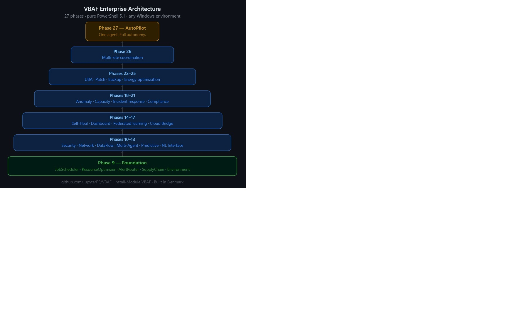

# VBAF — Visual Business Automation Framework

> **v4.0.0** · PowerShell 5.1 · DQN Reinforcement Learning · Enterprise Automation Engine

[](LICENSE)
[](https://github.com/PowerShell/PowerShell)
[](https://www.powershellgallery.com/packages/VBAF)
[](https://www.powershellgallery.com/packages/VBAF)
[](https://github.com/JupyterPS/VBAF/stargazers)

## Architecture


## What is VBAF?

VBAF is a PowerShell 5.1 framework that trains Deep Q-Network (DQN) agents to make autonomous enterprise IT decisions. Each agent observes real Windows system signals and learns the optimal action through reinforcement learning — no hardcoded rules, no thresholds, no if/else chains.

**27 phases. 14 enterprise pillars. 1 AutoPilot to rule them all.**

## Quick Start
```powershell
Install-Module VBAF -Scope CurrentUser
Import-Module VBAF
. .\VBAF.LoadAll.ps1
$r = Invoke-VBAFAutoPilotTraining -Episodes 100 -PrintEvery 10 -SimMode
```

## Documentation & Reference

| Document | Description |
|----------|-------------|
| [VBAF.CheatSheet.md](VBAF.CheatSheet.md) | **Start here** — all functions, parameters, valid values and common gotchas in one page |
| [tutorials/01_Beginner_GettingStarted.md](tutorials/01_Beginner_GettingStarted.md) | Getting started guide |
| [tutorials/02_Beginner_FirstClassifier.ps1](tutorials/02_Beginner_FirstClassifier.ps1) | Your first classification model |
| [tutorials/03_Advanced_FullPipeline.ps1](tutorials/03_Advanced_FullPipeline.ps1) | Full ML pipeline end to end |
| [tutorials/04_Project_HousePriceMLOps.ps1](tutorials/04_Project_HousePriceMLOps.ps1) | Real-world MLOps project |
| [tutorials/05_Project_AnomalyDetection.ps1](tutorials/05_Project_AnomalyDetection.ps1) | Anomaly detection project |
| [tutorials/VBAF.Templates.ps1](tutorials/VBAF.Templates.ps1) | Reusable workflow recipes |

## Requirements

- Windows 10 or 11
- PowerShell 5.1 (included with Windows)
- No additional dependencies

## License

MIT License — see [LICENSE](LICENSE) for details.

## Author

**Henning** · Roskilde, Denmark ????
Built with Claude (Anthropic) · PowerShell ISE · PS 5.1

*"Intelligent automation for the Windows environments that power the world."*
